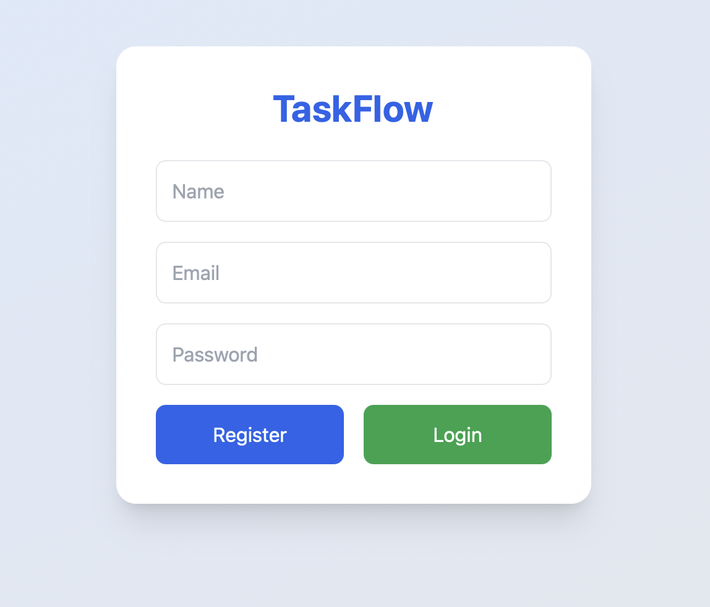
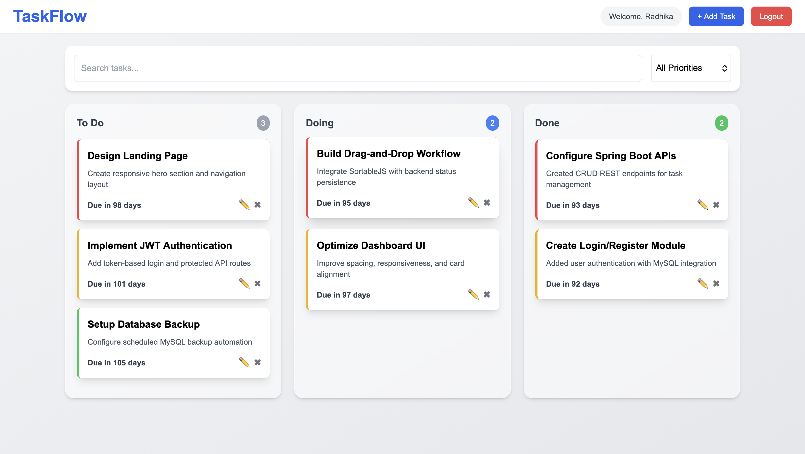
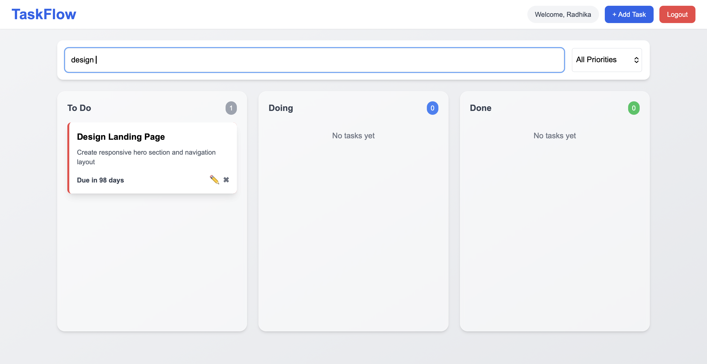
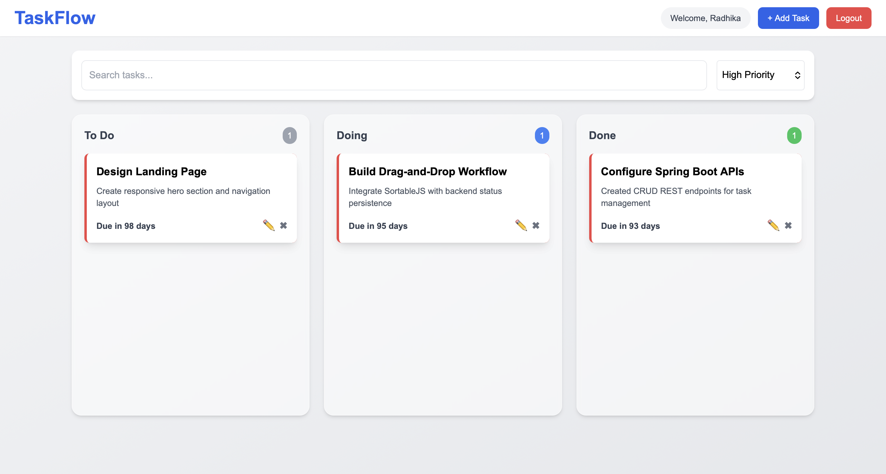

# TaskFlow – Kanban Task Manager

TaskFlow is a full-stack productivity web application that helps users manage tasks visually using a Kanban-style workflow system inspired by Trello and Jira.

## Features
- User Registration & Login
- Multi-user task management
- Drag-and-drop Kanban workflow
- Task CRUD operations
- Priority-based task cards
- Search and filtering
- Persistent MySQL storage
- Responsive UI
- 
## Key Highlights

- Multi-user authentication system
- Persistent drag-and-drop workflow
- Real-time frontend/backend synchronization
- RESTful API architecture
- Responsive modern UI

## Tech Stack

### Frontend
- HTML
- Tailwind CSS
- JavaScript
- SortableJS

### Backend
- Spring Boot
- Spring Data JPA
- MySQL

## Project Structure

```text
taskflow-frontend/
taskflow-backend/
```

## Kanban Workflow

```text
To Do → Doing → Done
```

## Screenshots

### Login Page


### Dashboard


### Filtering Tasks
### Filtering Tasks



## Setup Instructions

### Backend

1. Open `taskflow-backend` in IntelliJ
2. Configure MySQL credentials in `application.properties`
3. Create MySQL database:

```sql
CREATE DATABASE taskflow_db;
```

4. Run Spring Boot application


### Frontend

1. Open `taskflow-frontend` in VS Code
2. Run using Live Server

## API Endpoints

### Auth
- POST `/auth/register`
- POST `/auth/login`

### Tasks
- GET `/tasks/user/{userId}`
- POST `/tasks`
- PUT `/tasks/{id}`
- DELETE `/tasks/{id}`

